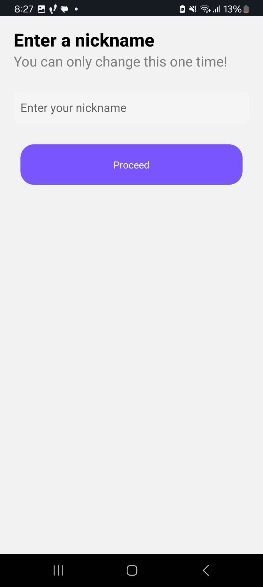
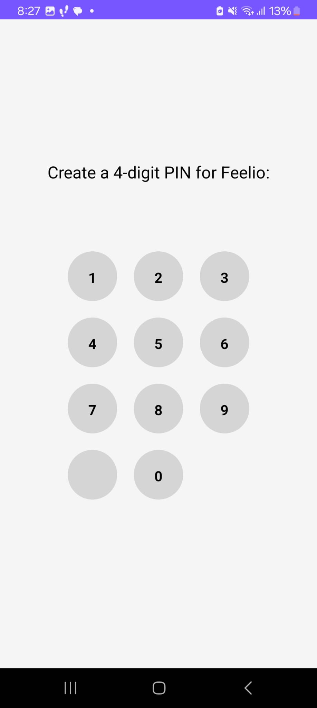
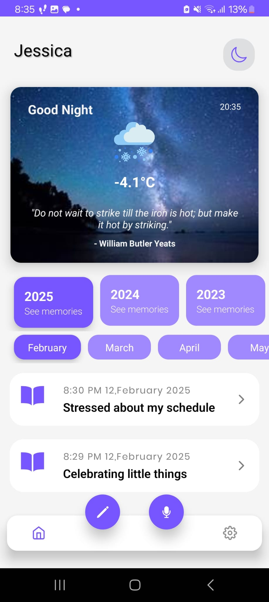
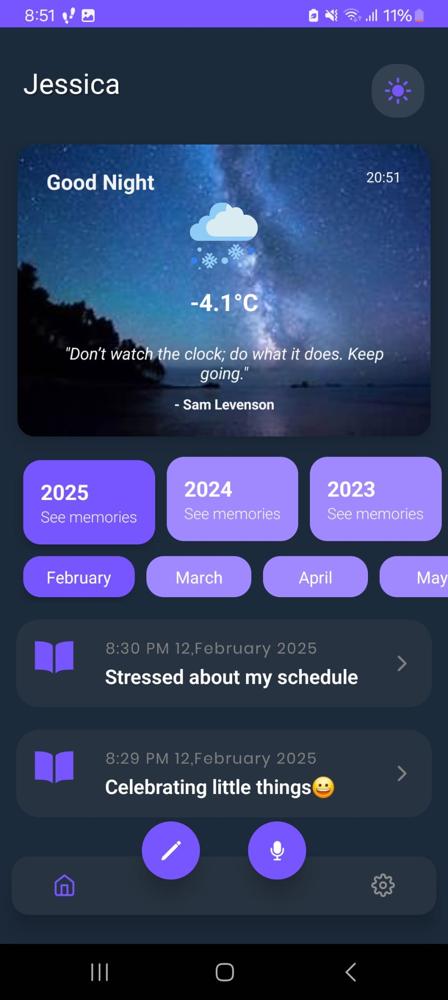
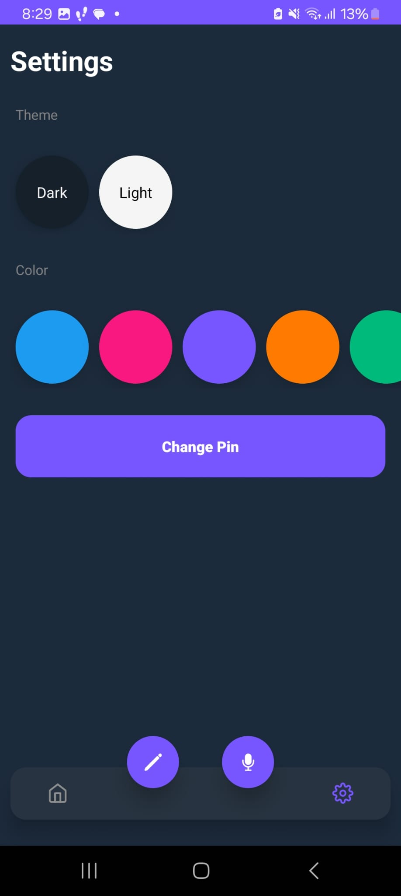
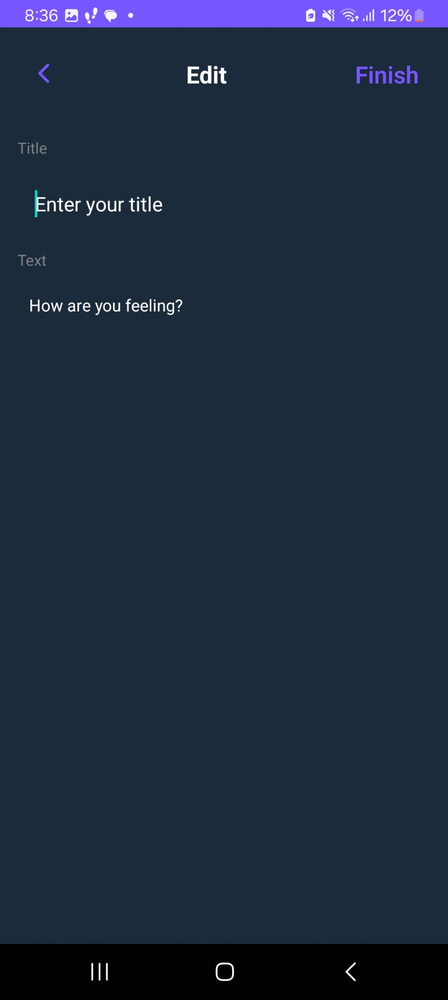

<h1 align="center">📔 MemoirSpace</h1>
<p align="center">Your Private Digital Sanctuary</p>

<div align="center">

[](https://reactnative.dev/)
[](https://expo.io/)

</div>

## 🌟 Introduction

MemoirSpace is a modern digital diary that combines security with elegant design. Write freely, reflect on your personal journey, and organize your memories in a private, encrypted space.

**Key Value Proposition**:
- 🔒 Military-grade encryption for entries
- 🎨 Fully customizable interface
- 📆 Smart chronological organization
- ☁️ Cross-device synchronization

<h2>🖼 Screenshots</h2>
<div align="center">
  
  
  
  
  
  
  
   
</div>


## 🚀 Features

### Security & Privacy
- 🔑 Password-protected access
- 🔒 AES-256 encryption for all entries
- 🕵️♂️ Incognito mode with biometric authentication

### Customization
- 🎨 Multiple theme options (dark/light/custom)
- ✍️ Rich text formatting capabilities
- 🖼️ Media embedding (photos, voice notes)

### Organization
- 📅 Automatic date-based categorization
- 🔍 Advanced search functionality
- 🏷️ Tagging system for entries

## 🛠️ Technologies Used


## ⚙️ Installation

```bash
# Clone repository
git clone https://github.com/JaskiratCodeKaur/MemoirSpace.git

# Install dependencies
npm install

# Configure environment
cp .env.example .env
```
<h2>🌐 API Setup</h2>
<details>
<summary>📌 Get Weather API Key</summary>
<ol>
  <li>Visit <a href="https://www.weatherapi.com/">weatherapi.com</a></li>
  <li>Create free account</li>
  <li>Copy your API key</li>
  <li>Create <code>api/weatherAPI.js</code> file:</li>
</ol>

<pre><code class="language-javascript">const apiKey = "YOUR_API_KEY_HERE";</code></pre>
</details>

<h2>🤝 Contributing</h2>
<div style="background: #f5f5f5; padding: 15px; border-radius: 5px;">
  <ol>
    <li>Fork the Project</li>
    <li>Create your Feature Branch
      <pre><code>git checkout -b feature/AmazingFeature</code></pre>
    </li>
    <li>Commit your Changes
      <pre><code>git commit -m 'Add some AmazingFeature'</code></pre>
    </li>
    <li>Push to the Branch
      <pre><code>git push origin feature/AmazingFeature</code></pre>
    </li>
    <li>Open a Pull Request</li>
  </ol>
</div>
